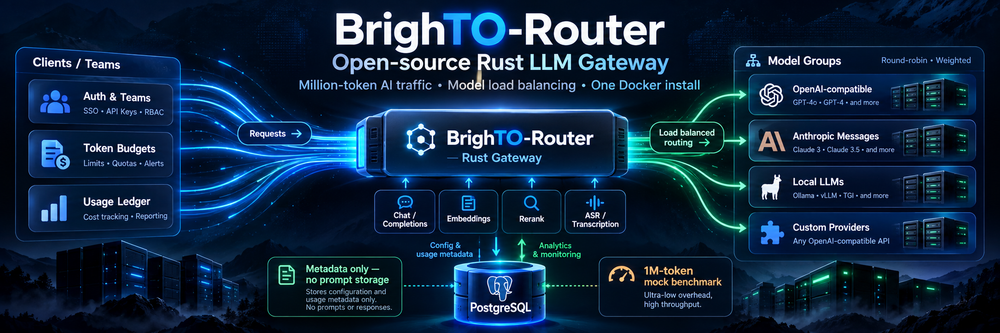

# BrighTO-Router — Open-source LLM Gateway in Rust

**Million-token AI traffic, simple Rust fast path, one Docker install.**

BrighTO-Router, also searchable as **Brighto LLM Router**, is a free open-source, self-hosted LLM gateway and AI router written in Rust. It gives teams one stable API endpoint for OpenAI-compatible, Anthropic-compatible, cloud, and local models with model load balancing, fallback routing, team API keys, token budgets, usage analytics, and privacy-first logging.




## Why this exists

Most teams do not need a large hosted AI platform to start. They need a fast, understandable LLM API proxy that they can run, audit, and maintain. BrighTO-Router focuses on the traffic path: authenticate, enforce budget, choose model route or Model Group, forward the request, stream the response, and record usage metadata.

## Core features

- OpenAI-compatible `/v1/chat/completions`, `/v1/completions`, `/v1/embeddings`
- Anthropic-compatible `/v1/messages`
- Rerank and ASR adapter routes
- Round-robin and weighted Model Groups for load balancing
- Team API keys, expiry, token budgets, RPM limits, and concurrency limits
- PostgreSQL usage ledger and Portal dashboard
- No prompt or response content stored by default
- One-line Docker install

## Quick start

```bash
curl -fsSL https://raw.githubusercontent.com/thusinh1969/BrighTO_Router/main/install.sh | bash
```

Then open:

```text
http://127.0.0.1:18080/
```

## Repository and Docker image

- GitHub: [thusinh1969/BrighTO_Router](https://github.com/thusinh1969/BrighTO_Router)
- Docker: `thusinh1969/brighto_airouter:v1`
- Release: `v1.0.1`

## Benchmarks

BrighTO-Router publishes deterministic mock-backend benchmarks to measure router overhead, not model inference speed. The 1M-token and Model Group artifacts are in the repository under `benchmarks/artifacts/`.

## Keywords

LLM gateway, LLM router, AI gateway, AI router, OpenAI API proxy, Anthropic API router, self-hosted LLM proxy, model router, model load balancer, fallback routing, token budget, cost reduction, LiteLLM alternative, Bifrost alternative, Rust API gateway.
